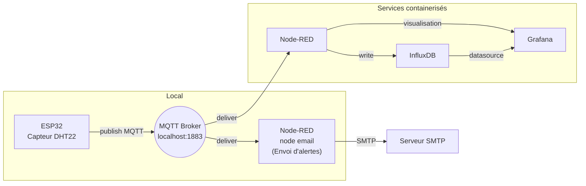
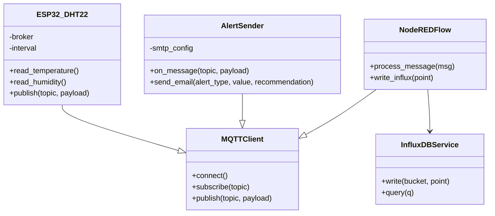

# Système d'alerte pour catastrophes naturelles (IoT virtuel)

Année universitaire 2025–2026

## 1. Description
Ce projet consiste à concevoir et implémenter un système IoT virtuel d’alerte pour catastrophes naturelles.
Il simule des capteurs environnementaux (niveau d’eau, niveau d’inondation et détection d’incendie) et met en place une chaîne complète de collecte, traitement, stockage, visualisation et notification des données.

Les mesures sont publiées via le protocole MQTT, traitées en temps réel avec Node-RED, stockées sous forme de séries temporelles dans InfluxDB, puis visualisées à l’aide de Grafana.
Un composant dédié permet l’envoi automatique d’alertes par email lorsqu’un seuil critique est dépassé.

## 2. Objectifs
- Simuler des capteurs et publier des données via MQTT.
  
- Centraliser et traiter les flux avec Node-RED.
  
- Stocker les mesures dans InfluxDB.
  
- Visualiser via Grafana.
  
- Détecter automatiquement les situations critiques et notifier par email.


## 3. Architecture (vue d'ensemble)

- Capteurs simulés: `ESP32 (DHT32)` (publie sur topics MQTT `sensors/waterlevel`, `sensors/floodlevel`, `sensors/fire`).
- Broker MQTT: instance locale (`mosquitto`) attendue sur `localhost:1883`.
- Traitement: Node-RED (flow fourni dans `nodes_red.json`).
- Stockage: InfluxDB (configuration dans `docker-compose.yaml`).
- Visualisation: Grafana (exposée sur le port 3000).
- Alertes: `node email` (s'abonne aux topics et envoie des emails HTML).

## 4. Contenu du dépôt
- `ESP32` : simulateur de capteurs en Python.
- `node-red(email)` : service d'envoi d'alerte par email (via SMTP).
- `nodes_red.json` : export du flow Node-RED à importer.
- `docker-compose.yaml` : compose pour InfluxDB, Grafana et Node-RED.
- `config.txt` : notes, commandes utiles.
- `package.json` : dépendances Node-RED (dashboard, influxdb contrib).

## 5. Prérequis
- Docker & Docker Compose (pour déployer les services rapidement).
- Python 3.8+ et `paho-mqtt` (si vous exécutez les scripts localement).
- Un broker MQTT (Mosquitto). Si vous utilisez Docker Compose, Node-RED peut se connecter à un broker externe ; les scripts actuels supposent `localhost:1883`.


## 6. Lancer les services (Docker Compose)
Les services InfluxDB, Grafana et Node-RED sont fournis dans `docker-compose.yaml`.

```bash
docker compose up -d
```

Accès :
- Grafana: http://localhost:3000/ (admin: `admin` / `admin123` d'après le compose)
- Node-RED: http://127.0.0.1:1880/
- InfluxDB: http://localhost:8086/

InfluxDB initial : utilisateur `admin`, mot de passe `admin123`, organisation `my-org`, bucket `iot_sensors` (voir variables d'environnement dans `docker-compose.yaml`). Le token initial est `mysecrettoken123`.

## 7. Exécuter les scripts localement (sans Docker)

1) Démarrer un broker MQTT (Mosquitto) local sur le port 1883.
2) La simulation est réalisée sur la plateforme Wokwi en utilisant un ESP32 programmé en MicroPython avec le protocole MQTT.
Le diagramme matériel (diagram.json) et le script (main.py) ont été copiés et exécutés dans Wokwi.


Note: les scripts se connectent à `localhost:1883` et utilisent des topics MQTT listés ci-dessus.

## 8. Node-RED
- Importez `nodes_red.json` via l'interface Node-RED (menu > Import > Clipboard) pour charger le flow fourni.
- Le flow contient des conversions de payload, des charts pour le dashboard, et des fonctions qui limitent la fréquence d'affichage des toasts d'alerte.
- Pour écrire dans InfluxDB depuis Node-RED, configurez le node `influxdb` avec l'URL `http://influxdb:8086` (si Node-RED est conteneurisé) ou `http://localhost:8086` selon votre configuration, et utilisez le token `mysecrettoken123` ou un token approprié.

## 9. Seuils d'alerte (valeurs par défaut dans `node email`)
- `sensors/waterlevel` : alerte si valeur > 80 (cm)
- `sensors/floodlevel` : alerte si valeur > 40 (cm)
- `sensors/fire` : alerte si payload == 1

## 10. Configuration des emails et sécurité
Les identifiants SMTP sont actuellement stockés en clair dans le flow Node-RED, uniquement à des fins de test.


## 11. Dépannage rapide
- Si Node-RED ne se connecte pas à InfluxDB : vérifiez l'URL, le token et la connectivité réseau entre conteneurs.
- Si aucun message MQTT n'arrive : vérifiez que Mosquitto fonctionne et que `ESP32` publie sur les bons topics.
- Si les emails ne partent pas : vérifiez les paramètres SMTP, le port, et que le mot de passe d'application (pour Gmail) est utilisé.

## 12. Schémas et diagrammes

### Schéma d'architecture


Ce schéma montre le flux principal : les simulateurs publient des messages MQTT, le broker les distribue à Node-RED (traitement + stockage) et à `node-red(email)` (notifications). Grafana et InfluxDB sont utilisés pour la visualisation et le stockage.

### Diagramme de classes (conceptuel)


Ce diagramme est conceptuel et montre les responsabilités principales : `SensorSimulator` publie des messages via `MQTTClient`, `NodeREDFlow` consomme et stocke les données, et `AlertSender` gère la logique d'alerte et l'envoi d'emails.
