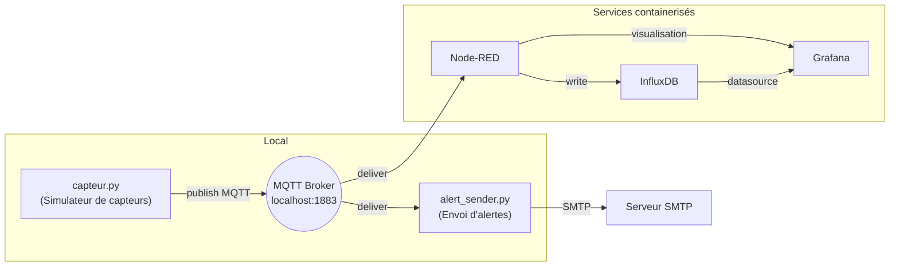
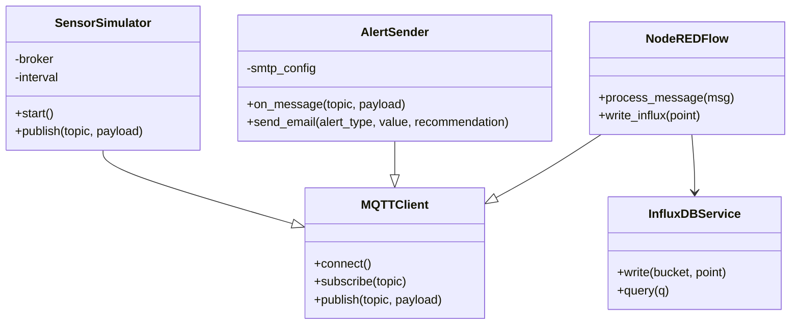

# Système d'alerte pour catastrophes naturelles (IoT virtuel)

Année universitaire 2025–2026

## 1. Description
Ce projet implémente un système IoT virtuel d'alerte pour catastrophes naturelles. Il simule des capteurs environnementaux (niveau d'eau, inondation, détection d'incendie), publie les mesures via MQTT, traite les flux avec Node-RED, stocke les séries temporelles dans InfluxDB et visualise les données avec Grafana. Un composant Python envoie des emails d'alerte lorsque des seuils critiques sont dépassés.

## 2. Objectifs
- Simuler des capteurs et publier des données via MQTT.
- Centraliser et traiter les flux avec Node-RED.
- Stocker les mesures dans InfluxDB.
- Visualiser via Grafana.
- Détecter automatiquement les situations critiques et notifier par email.

## 3. Architecture (vue d'ensemble)

- Capteurs simulés: `capteur.py` (publie sur topics MQTT `sensors/waterlevel`, `sensors/floodlevel`, `sensors/fire`).
- Broker MQTT: instance locale (`mosquitto`) attendue sur `localhost:1883`.
- Traitement: Node-RED (flow fourni dans `nodes_red.json`).
- Stockage: InfluxDB (configuration dans `docker-compose.yaml`).
- Visualisation: Grafana (exposée sur le port 3000).
- Alertes: `alert_sender.py` (s'abonne aux topics et envoie des emails HTML).

## 4. Contenu du dépôt
- `capteur.py` : simulateur de capteurs en Python.
- `alert_sender.py` : service d'envoi d'alerte par email (via SMTP).
- `nodes_red.json` : export du flow Node-RED à importer.
- `docker-compose.yaml` : compose pour InfluxDB, Grafana et Node-RED.
- `config.txt` : notes, commandes utiles.
- `package.json` : dépendances Node-RED (dashboard, influxdb contrib).

## 5. Prérequis
- Docker & Docker Compose (pour déployer les services rapidement).
- Python 3.8+ et `paho-mqtt` (si vous exécutez les scripts localement).
- Un broker MQTT (Mosquitto). Si vous utilisez Docker Compose, Node-RED peut se connecter à un broker externe ; les scripts actuels supposent `localhost:1883`.

Installer la dépendance Python :

```bash
pip install paho-mqtt
```

Si vous n'avez pas Mosquitto, installez-le :

Windows (choco) :

```powershell
choco install mosquitto
# puis démarrer le service ou exécuter mosquitto en standalone
```

## 6. Lancer les services (Docker Compose)
Les services InfluxDB, Grafana et Node-RED sont fournis dans `docker-compose.yaml`.

```bash
docker compose up -d
```

Accès :
- Grafana: http://localhost:3000/ (admin: `admin` / `admin123` d'après le compose)
- Node-RED: http://127.0.0.1:1880/
- InfluxDB: http://localhost:8086/

InfluxDB initial : utilisateur `admin`, mot de passe `admin123`, organisation `my-org`, bucket `iot_sensors` (voir variables d'environnement dans `docker-compose.yaml`). Le token initial est `mysecrettoken123`.

## 7. Exécuter les scripts localement (sans Docker)

1) Démarrer un broker MQTT (Mosquitto) local sur le port 1883.
2) Lancer le simulateur de capteurs :

```bash
python capteur.py
```

3) Lancer le service d'alerte :

```bash
python alert_sender.py
```

Note: les scripts se connectent à `localhost:1883` et utilisent des topics MQTT listés ci-dessus.

## 8. Node-RED
- Importez `nodes_red.json` via l'interface Node-RED (menu > Import > Clipboard) pour charger le flow fourni.
- Le flow contient des conversions de payload, des charts pour le dashboard, et des fonctions qui limitent la fréquence d'affichage des toasts d'alerte.
- Pour écrire dans InfluxDB depuis Node-RED, configurez le node `influxdb` avec l'URL `http://influxdb:8086` (si Node-RED est conteneurisé) ou `http://localhost:8086` selon votre configuration, et utilisez le token `mysecrettoken123` ou un token approprié.

## 9. Seuils d'alerte (valeurs par défaut dans `alert_sender.py`)
- `sensors/waterlevel` : alerte si valeur > 80 (cm)
- `sensors/floodlevel` : alerte si valeur > 40 (cm)
- `sensors/fire` : alerte si payload == 1

## 10. Configuration des emails et sécurité
Le fichier `alert_sender.py` contient actuellement des identifiants SMTP en clair (pour tests).


## 11. Dépannage rapide
- Si Node-RED ne se connecte pas à InfluxDB : vérifiez l'URL, le token et la connectivité réseau entre conteneurs.
- Si aucun message MQTT n'arrive : vérifiez que Mosquitto fonctionne et que `capteur.py` publie sur les bons topics.
- Si les emails ne partent pas : vérifiez les paramètres SMTP, le port, et que le mot de passe d'application (pour Gmail) est utilisé.

## 12. Schémas et diagrammes

### Schéma d'architecture


Ce schéma montre le flux principal : les simulateurs publient des messages MQTT, le broker les distribue à Node-RED (traitement + stockage) et à `alert_sender.py` (notifications). Grafana et InfluxDB sont utilisés pour la visualisation et le stockage.

### Diagramme de classes (conceptuel)


Ce diagramme est conceptuel et montre les responsabilités principales : `SensorSimulator` publie des messages via `MQTTClient`, `NodeREDFlow` consomme et stocke les données, et `AlertSender` gère la logique d'alerte et l'envoi d'emails.
